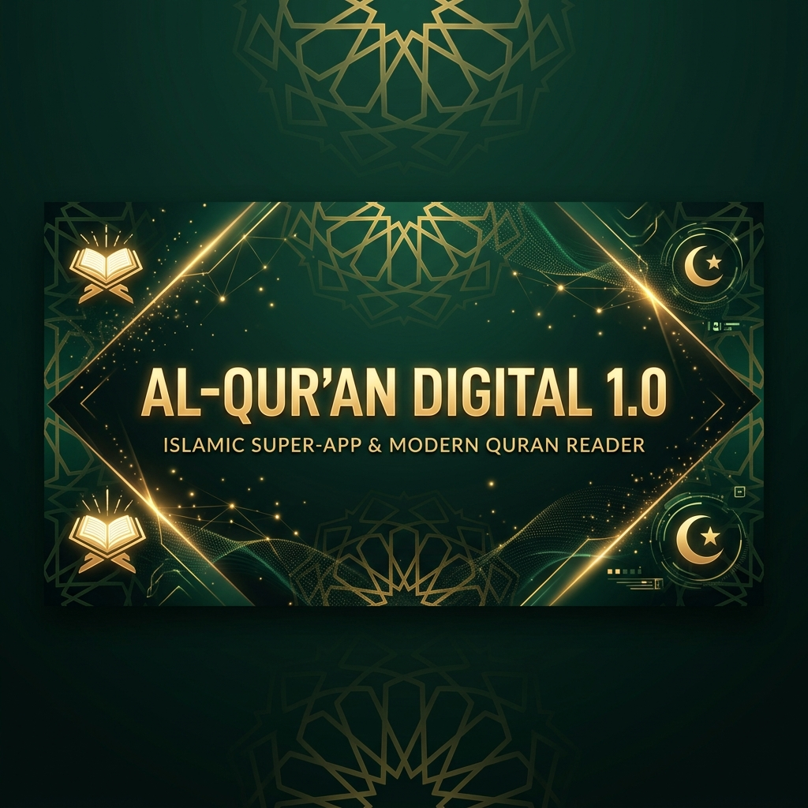

<div align="center">

  # 📖 Al-Qur'an Digital 1.0

  <p align="center">
    <b>Islamic Super-App Modern & Quran Reader Pro</b><br />
    Aplikasi Web Al-Qur'an Digital interaktif berbasis Next.js 16 (Turbopack) dengan Tajweed Berwarna, Kompas Kiblat 3D, Murottal per Ayat, Gamifikasi Ibadah, dan Asisten AI Companion.
  </p>

  <!-- Badges section -->
  <p align="center">
    <a href="https://al-quran-1-0.vercel.app/">
      
    </a>
    
    
    
    
    
    
  </p>

  <!-- Header Banner Image -->
  <br />
  <a href="https://al-quran-1-0.vercel.app/">
    
  </a>
  <br />
  <br />

  <!-- Quick Action Nav Link Buttons -->
  <h3>
    <a href="https://al-quran-1-0.vercel.app/">🚀 Live Demo</a>
    &nbsp;&bull;&nbsp;
    <a href="#-fitur-unggulan--interaktif">✨ Fitur Utama</a>
    &nbsp;&bull;&nbsp;
    <a href="#%EF%B8%8F-tech-stack--dependencies">🛠️ Tech Stack</a>
    &nbsp;&bull;&nbsp;
    <a href="#-instalasi--menjalankan-lokal">📥 Instalasi</a>
    &nbsp;&bull;&nbsp;
    <a href="#-struktur-direktori-utama">📁 Struktur Projek</a>
  </h3>

</div>

---

## 🌟 Akses Cepat & Tautan Penting

| Resource | Deskripsi | Link |
| :--- | :--- | :---: |
| 🚀 **Live Demo Web App** | Akses versi live aplikasi di Vercel | [Buka Live App](https://al-quran-1-0.vercel.app/) |
| 📖 **Quran Reader Pro** | Baca Qur'an lengkap dengan audio & tajweed | [Mulai Membaca](https://al-quran-1-0.vercel.app/) |
| 🕌 **Kompas Kiblat 3D** | Arah Ka'bah interaktif berbasis sensor | [Cek Kiblat](https://al-quran-1-0.vercel.app/) |
| 🎓 **Learn Academy** | Roadmap belajar modul agama & kuis | [Mulai Belajar](https://al-quran-1-0.vercel.app/) |

---

## ✨ Fitur Unggulan & Interaktif

### 1. 📖 Quran Reader Pro & Murottal Ayat-per-Ayat
- 🎨 **Tajweed Berwarna (Color-Coded):** Pewarnaan otomatis teks Uthmani secara visual (Madd, Qalqalah, Ghunnah, dll.) sesuai kaidah tajwid resmi.
- 💡 **Panduan Legenda Tajwid:** Laci info detail makna warna tajwid dilengkapi klip audio contoh pengucapan.
- 🎵 **Play per Ayat & Auto-Scroll:** Klik putar dari ayat mana saja, audio MP3 dari Syekh Mishari Rasyid terputar instan, dan pembacaan otomatis bergeser (*scroll*) mengikuti jalannya bacaan.
- 🏝️ **Dynamic Island Audio Player:** Audio player yang dapat di-minimize menjadi kapsul melayang dinamis di bagian atas layar desktop maupun mobile.
- 🖼️ **Share Ayat as Image:** Ekspor ayat pilihan menjadi gambar PNG gradien resolusi tinggi dengan watermark *"Linux 25"* yang siap di-download atau disalin ke clipboard.

### 2. 🕌 Jadwal Sholat & Kompas Kiblat 3D
- 🧭 **Kompas Kiblat Interaktif:** Gyroscope & DeviceOrientation API mendeteksi arah Ka'bah secara 3D waktu nyata dengan visual kompas berputar dinamis.
- ⏰ **Waktu Sholat Akurat:** Deteksi koordinat GPS otomatis dengan countdown sholat berikutnya.

### 3. 🗓️ Kalender Hijriyah & Event Tracker
- 📅 **Tear-Off Calendar:** Tampilan visual kalender sobek estetik di beranda dengan translasi ejaan nama bulan Hijriyah bahasa Indonesia.
- 📌 **Event Slider:** Navigasi tombol (Prev/Next) untuk melihat 10 hari besar Islam tahun ini.

### 4. 🎓 Learn Academy (Sequential Roadmap)
- 🗺️ **Jalur Belajar Mualaf:** 9 modul belajar interaktif dari Rukun Islam hingga Fikih Jual Beli.
- 🎯 **3 Sesi Kelas Virtual:** Membaca/Menonton Video Youtube ter-embed &rarr; Uji Pemahaman (Kuis minimal skor 70% untuk melaju) &rarr; Layar Kelulusan (+50 XP & selebrasi).

### 5. 💰 Haji & Umroh Savings Planner
- 📈 **Kalkulator Inflasi:** Menghitung perkiraan biaya masa depan, target bulanan/harian, dan potongan gaji.
- 📊 **Savings Tracker & Streak:** Mengelola catatan tabungan harian, riwayat setoran, serta streak konsistensi menabung.
- 🤲 **Doa & Panduan:** Checklist 8 langkah wajib ibadah haji terintegrasi doa-doa maknawi.

### 6. 🕹️ Gamification, Quests & Parent Dashboard
- ⚡ **Leveling System:** Dapatkan XP dari membaca Qur'an, dzikir (cincin tasbih ber-haptic), sholat, dan kuis.
- 🎁 **Daily Quests & Lootbox:** Jalankan 3 quest harian sholat, dzikir, dan membaca untuk membuka peti harian (Lootbox).
- 👨‍👩‍👧 **Parent Dashboard:** Halaman pantau progres ibadah anak, lencana (Badges) yang diraih, dan grafik aktivitas.

### 7. 🤖 Omnipresent AI Chat Companion
- 💬 **Floating Chat Bubble:** Asisten AI yang selalu melayang di kanan bawah layar. Dapat di-klik untuk membuka obrolan interaktif tanpa perlu berpindah dari halaman bacaan Anda.

---

## 🛠️ Tech Stack & Dependencies

| Kategori | Teknologi | Deskripsi |
| :--- | :--- | :--- |
| **Core Framework** | Next.js 16.3 (Turbopack), React 19, TypeScript 5 | Framework modern SSR/SSG & App Router |
| **Design System** | Tailwind CSS v4, shadcn/ui, Lucide Icons | Styling responsif & komponen UI modern |
| **State Management** | Zustand v5 (Persist middleware) | State global ringan dengan sinkronisasi LocalStorage |
| **Animation & Export** | Framer Motion v12, Html2canvas | Animasi fluid & ekspor gambar ayat |
| **AI Engine** | Google Gemini SDK (`gemini-3.5-flash`) | Asisten AI pintar responsif |
| **PWA & Offline** | Service Worker, Web Manifest | Caching offline & installable PWA app |

---

## 🚀 Instalasi & Menjalankan Lokal

Panduan langkah demi langkah untuk menjalankan proyek di komputer lokal Anda:

```bash
# 1. Clone repository ini
git clone https://github.com/RahmannCH/Al-Qur-an_1.0.git

# 2. Masuk ke direktori projek
cd Al-Qur-an_1.0

# 3. Install seluruh dependencies
npm install

# 4. Konfigurasi Environment Variable
# Buat file .env.local di root folder dan tambahkan Gemini API Key Anda:
GEMINI_API_KEY=kunci_gemini_anda_disini

# 5. Jalankan Development Server
npm run dev
```

Buka [http://localhost:3000](http://localhost:3000) di browser untuk melihat aplikasi berjalan secara lokal!

---

## 📁 Struktur Direktori Utama

```
Al-Qur'an_1.0/
├── public/                 # Service Worker (sw.js), Manifest PWA, Banner & Ikon
├── src/
│   ├── app/                # Halaman Utama, Dynamic Routes, API chat Gemini
│   ├── components/
│   │   ├── home/           # Widget Bento, Asmaul Husna, Murottal, Onboarding
│   │   ├── layout/         # Header, Bottom Nav, Floating AI Chat, SW Registry
│   │   ├── quran/          # AyahList, AyahCard, TajweedText, Share Modal
│   │   ├── prayer/         # PrayerStreak, Qibla Compass
│   │   └── ui/             # Shadcn primitives
│   ├── store/              # Zustand global state (XP, Haji, Belajar, Reminder, Sholat)
│   ├── data/               # Data statis (99 Asmaul Husna, Soal Kuis, 25 Doa)
│   ├── lib/                # Audio SFX sintetis, Tajweed parser, Wita time sensor
│   ├── hooks/              # Custom React hooks (Time Theme)
│   └── types/              # Deklarasi tipe data TypeScript (Qur'an & Prayer)
```

---

## 📜 Lisensi & Pengembangan

Proyek ini dibuat dan dikembangkan di bawah lisensi **MIT License**. Terbuka untuk kontribusi, saran, dan *Pull Request* (PR).

<div align="center">
  <sub>Built with ❤️ for Islamic Tech & Community</sub>
</div>
